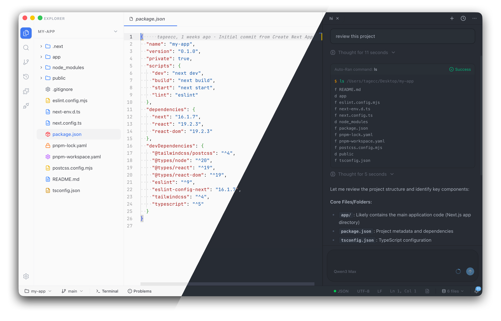

<div align="center">

# Circle

**Local-first AI-native Desktop IDE**

Complete coding, Git, terminal, and AI collaboration in a single window

[](LICENSE)
[](https://pnpm.io)
[](https://github.com/tageecc/circle/actions/workflows/ci.yml)
[](https://github.com/tageecc/circle/releases)

[Download](#download) · [Quick Start](#quick-start) · [Core Features](#core-features) · [Tech Stack](#tech-stack) · [Roadmap](#roadmap)

[简体中文](./README.zh-CN.md)

</div>

---

## Preview



---

## Introduction

Circle is an Electron-based local desktop IDE that deeply integrates code editing, Git workflow, terminal, and AI dialogue in the same interface. All data and vector indexes are stored locally in SQLite/LibSQL, requiring no self-hosted backend.

---

## Core Features

### 🤖 AI-Native Development Experience

- **Natural Language Project Generation**: Describe your requirements on the welcome page, AI automatically generates complete project structure and writes to disk
- **Inline Ghost Completion**: Dedicated model configuration support, TS/JS Shadow diagnostics, layered with list completion
- **Codebase Semantic Indexing**: Embedding models provide precise context retrieval for conversations
- **Human-in-the-loop Confirmation**: Dual-pane Diff comparison before AI modifies files, accept or reject each change

### 🔧 Complete Development Toolchain

- **Monaco Editor**: TypeScript/JavaScript language services, Markdown preview, multi-tab management
- **Integrated Git**: Workspace status, commit, push, branch switching, Diff, history, Blame visualization
- **Real Terminal**: node-pty driven multi-tab Shell, supports AI tool command injection and output feedback
- **Problems Panel**: Aggregates workspace diagnostics, real-time feedback from language services

### 🧩 Extensible AI Tool Ecosystem

- **MCP Protocol**: Configure external MCP servers, automatically sync tools to conversations
- **Skills**: Mount skill descriptions in user directory and workspace, assistant fetches details on demand (progressive disclosure)
- **Built-in Toolset**: Semantic search, grep, file operations, terminal commands, web search, task lists, etc.

### 🏠 Local-first & Privacy

- **Local Storage**: SQLite/LibSQL saves business data and vector indexes, no cloud dependencies
- **Multi-model Support**: Configure API Keys for any provider (OpenAI/Anthropic/Google, etc.)
- **Offline Available**: Core features like editing, Git, terminal work without network

---

## Download

### Pre-built Releases

Visit [GitHub Releases](https://github.com/tageecc/circle/releases) to download the installer for your OS:

- **Windows**: `circle-{version}-setup.exe`
- **macOS**: `circle-{version}.dmg`
- **Linux**: `circle-{version}.AppImage` / `.deb` / `.snap`

> The first official release is coming soon. To experience the latest features, please refer to [Quick Start](#quick-start) below to build from source.

---

## Roadmap

**[x]** Completed · **[ ]** Planned

### Project & Workspace

- [x] Open local folder, recent projects list
- [x] Clone from Git repository
- [x] Create new empty folder project
- [x] Welcome page: Describe requirements in natural language, AI generates and saves complete project then auto-opens
- [x] Multi-tab editing, unsaved file warnings
- [ ] Multi-root workspace (multiple folders in single window)

### Editor

- [x] Monaco code editing (theme, font, indent, etc. linked with settings)
- [x] TypeScript/JavaScript language services (diagnostics, completion, navigation, etc.)
- [x] Markdown & image preview
- [x] Diff view (including AI file modification comparison confirmation flow)
- [x] AI inline ghost completion (toggleable, dedicated model configurable; TS/JS optional Shadow diagnostics)
- [x] Layered with list completion: quickSuggestions disabled to reduce conflicts
- [x] Git Blame inline decorations (configurable)

### AI & Automation

- [x] Sidebar streaming conversation, tool calls, file editing with human-in-the-loop confirmation
- [x] Built-in coding assistant: logic in `src/main/assistant/assistant.ts`; model & system prompts configured in **Settings → Models**
- [x] Codebase semantic indexing (**sqlite-vec** vector search + Embedding API; provider configured in settings)
- [x] MCP & tool extensions (**Settings → MCP & Tools**); Skills panel manages skill enablement and directories

### Terminal & Diagnostics

- [x] Integrated terminal (node-pty)
- [x] Problems panel aggregates diagnostics
- [x] Inject terminal commands from AI tool flow, etc. (implementation dependent on tools)

### Git

- [x] Workspace status, commit, push, pull/fetch, switch branch, create branch
- [x] Diff, file history, Blame, branch comparison

### Settings & Privacy

- [x] No account system: data & config all local (SQLite/userData)
- [x] Settings: General, Models, MCP, Skills, Appearance, Editor, Terminal, Shortcuts
- [x] Global AI user rules, Embedding, inline completion, etc. (model APIs self-configured by user)
- [x] Feedback written to local `userData/feedback` (not uploaded)
- [ ] Help menu "Welcome/Docs/About" still placeholders

### Other

- [x] `circle://` URL Scheme to launch app (main process protocol registration)
- [ ] Remote SSH workspace
- [ ] Language-level debugger (breakpoints, stepping)

---

## Quick Start

### Prerequisites

- **Node.js** 18+
- **pnpm** (matching `packageManager` field in `package.json`)

### Installation & Running

```bash
# Clone repository
git clone https://github.com/tageecc/circle.git
cd circle

# Install dependencies
pnpm install

# Start development mode
pnpm dev
```

### First-time Setup

1. **Configure Models**: Open **Settings → Models**, enter API Key and select provider & model ID
2. **Generate Project**: Enter project description on welcome page, AI generates complete project and auto-opens
3. **Daily Development**: File tree on left, editor in center, AI chat on right; terminal & problems panel at bottom

### Build & Package

```bash
pnpm build:win    # Windows
pnpm build:mac    # macOS
pnpm build:linux  # Linux
```

---

## Tech Stack

| Domain   | Technology                                                                            |
| -------- | ------------------------------------------------------------------------------------- |
| Frontend | React 19, TypeScript, Tailwind CSS, Radix/shadcn                                      |
| Desktop  | Electron, electron-vite                                                               |
| Editor   | Monaco Editor                                                                         |
| AI       | `@ai-sdk/provider` / `provider-utils`, native agent loops, multi-provider models, MCP |
| Data     | SQLite/LibSQL, Drizzle ORM, **sqlite-vec** (vector search)                            |
| Terminal | node-pty                                                                              |

---

## Contributing

We welcome all forms of contributions! Please read [CONTRIBUTING.md](CONTRIBUTING.md) to understand the development process and PR guidelines.

- **Bug Reports**: [Submit Issue](../../issues)
- **Feature Requests**: [Submit Feature Request](../../issues)
- **Code Contributions**: Fork → Branch → PR
- **Documentation Improvements**: Submit PR or Issue directly

Please adhere to our [Code of Conduct](CODE_OF_CONDUCT.md). For security issues, see [SECURITY.md](SECURITY.md).

---

## Star History

<a href="https://star-history.com/#tageecc/circle&Date">
 <picture>
   <source media="(prefers-color-scheme: dark)" srcset="https://api.star-history.com/svg?repos=tageecc/circle&type=Date&theme=dark" />
   <source media="(prefers-color-scheme: light)" srcset="https://api.star-history.com/svg?repos=tageecc/circle&type=Date" />
   
 </picture>
</a>

---

## License

[MIT License](LICENSE) © 2025 Circle

---

## Links

- [📥 Download Installer](https://github.com/tageecc/circle/releases)
- [📝 Changelog](CHANGELOG.md)
- [🔒 Security Policy](SECURITY.md)
- [💬 Get Help](SUPPORT.md)
