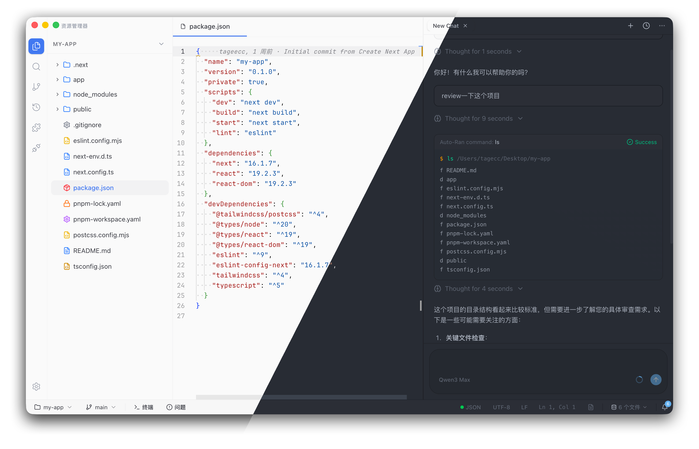

<div align="center">

# Circle

**本地优先的 AI IDE，内置可确认执行的编码 Agent**

在一个桌面工作区里完成写代码、看 Git、跑终端，以及和 AI 协作。

[](LICENSE)
[](https://github.com/tageecc/circle/actions/workflows/ci.yml)
[](https://github.com/tageecc/circle/releases)
[](#下载)

[下载](#下载) · [为什么是 Circle](#为什么是-circle) · [快速开始](#快速开始) · [核心特性](#核心特性) · [路线图](#路线图)

[English](./README.md)

</div>

---

## 预览



---

## 为什么是 Circle

Circle 面向想要 AI 能力、但又不想失去本地工作流控制权的开发者。它把完整闭环放进一个窗口里：代码编辑、Git、终端、MCP 工具、AI 对话与审查流都在同一个桌面工作区中完成。

- **不是五个标签页拼起来的工作流**：编辑器、Git、终端、AI 对话和审查都在一个界面里。
- **默认 Human-in-the-loop**：AI 修改文件和执行高风险命令前都先经过你确认。
- **本地优先架构**：项目数据、会话历史、向量索引都保留在你的机器上。
- **模型和工具由你掌控**：配置提供商凭据、在输入框选择模型，并通过 MCP 与 Skills 扩展能力。

---

## 快速开始

### 下载

前往 [GitHub Releases](https://github.com/tageecc/circle/releases) 下载最新安装包：

- **Windows**：`circle-{version}-setup.exe`
- **macOS**：`circle-{version}-{arch}.dmg`
- **Linux**：`circle-{version}.AppImage` / `.deb`

### 首次使用

1. 打开 **设置 → 模型**，添加你要使用的提供商凭据。
2. 在聊天输入框的模型选择器里，选择当前会话要使用的模型。
3. 打开本地文件夹、克隆仓库，或在欢迎页直接描述需求生成项目。
4. AI 修改文件或执行命令前，先经过你的确认。

### 从源码运行

```bash
git clone https://github.com/tageecc/circle.git
cd circle
pnpm install
pnpm dev
```

### 构建安装包

```bash
pnpm build:win
pnpm build:mac
pnpm build:linux
```

---

## 核心特性

### AI 原生编码工作流

- 欢迎页自然语言生成项目
- 右侧侧栏流式对话、规划与工具调用
- 基于本地向量索引的代码库语义搜索
- 在聊天输入框中按会话选择模型
- 支持专用模型的行内幽灵补全

### 安全的文件与命令执行

- AI 修改文件前先走 diff 审查流
- 高风险终端命令支持同意、拒绝、跳过
- 长任务和工具输出可直接在聊天中追踪

### 完整桌面开发环境

- Monaco 编辑器与 TypeScript / JavaScript 语言服务
- 集成 Git：状态、提交、推送、分支切换、Diff、历史、Blame
- 基于 `node-pty` 的真实终端
- Problems 面板聚合诊断与语言服务反馈

### 可扩展能力

- 支持接入外部 MCP 服务器
- 支持从用户目录和工作区加载 Skills
- 内置搜索、grep、文件操作、终端命令等工具

### 本地优先与隐私

- 无需账号体系
- 无需自建或依赖托管后端
- 数据和索引使用 SQLite / LibSQL 与 `sqlite-vec` 保存在本地

---

## 技术栈

| 领域   | 技术                                                                      |
| ------ | ------------------------------------------------------------------------- |
| 前端   | React 19、TypeScript、Tailwind CSS、Radix / shadcn                        |
| 桌面   | Electron、electron-vite                                                   |
| 编辑器 | Monaco Editor                                                             |
| AI     | `@ai-sdk/provider` / `provider-utils`、原生 Agent 循环、多提供商模型、MCP |
| 数据   | SQLite / LibSQL、Drizzle ORM、`sqlite-vec`                                |
| 终端   | node-pty                                                                  |

---

## 路线图

近期重点：

- 远程 SSH 工作区
- 多根工作区
- 语言级调试器集成
- 更完善的应用内帮助与文档入口

---

## 贡献

欢迎各种形式的贡献。开发流程与 PR 规范见 [CONTRIBUTING.md](CONTRIBUTING.md)。

- **Bug 反馈**：[提交 Issue](../../issues)
- **功能建议**：[提交 Issue](../../issues)
- **代码贡献**：Fork → 开分支 → PR
- **文档改进**：欢迎直接提 PR

请遵守 [行为准则](CODE_OF_CONDUCT.md)。安全问题请参阅 [SECURITY.md](SECURITY.md)。

---

## 许可证

[MIT License](LICENSE) © 2025 Circle

---

## 链接

- [发行版本](https://github.com/tageecc/circle/releases)
- [更新记录](CHANGELOG.md)
- [安全政策](SECURITY.md)
- [支持](SUPPORT.md)
